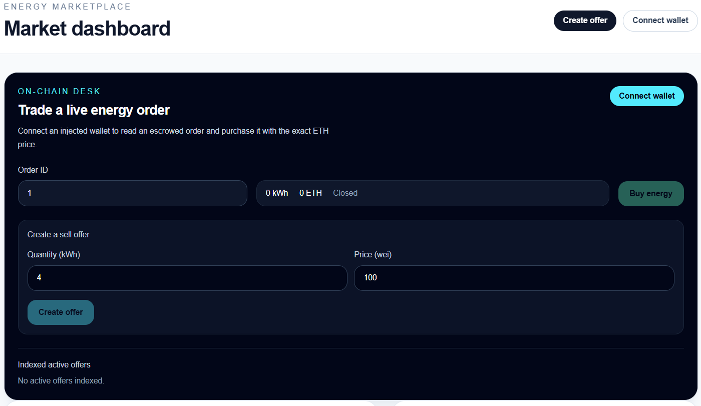
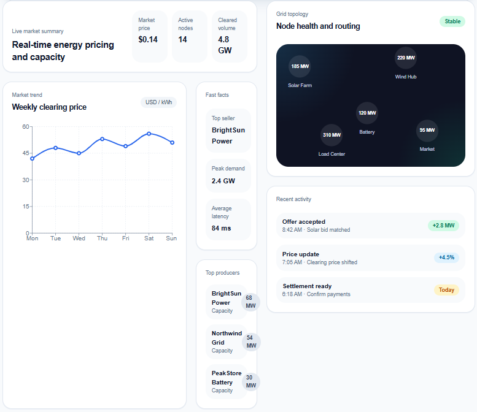

# Decentralized Energy Marketplace

A local-first peer-to-peer energy trading application. Energy is represented by
an ERC-20 token, while the marketplace uses full-fill escrow and native ETH for
settlement.

## Current Implementation

The project currently includes a working end-to-end local marketplace slice:

- `EnergyToken.sol`: owner-controlled ERC-20 token with whole-kWh units. One
	token represents one kWh; minting and burning are owner-only.
- `Marketplace.sol`: creates sell orders, escrows energy, accepts exact-ETH
	purchases, and supports seller cancellation with escrow refunds.
- NestJS backend: indexes `SellOrderCreated`, `EnergyPurchased`, and
	`SellOrderCancelled` events into SQLite and exposes active offers through
	`GET /v1/marketplace/offers`.
- Next.js frontend: connects a wallet, reads orders, creates offers through
	`approve` followed by `createSellOrder`, buys active orders, and displays
	transaction progress and errors.
- Local development bootstrap: starts Hardhat, deploys the contracts, seeds the
	local wallet with test ETH and energy, generates ignored environment files,
	and starts the backend and frontend.

The validated local lifecycle is:

```text
connect wallet -> approve ENRG -> create offer -> index active offer
-> buy energy -> index offer as inactive
```

## Home Page Screenshot

<br>


## Technology

- Smart contracts: Solidity 0.8.28, Hardhat 3, OpenZeppelin, Ethers.js
- Backend: NestJS, TypeORM, SQLite, Ethers.js
- Frontend: Next.js, TypeScript, Wagmi, Viem, Tailwind CSS, Recharts

## Run Locally

Install dependencies once:

```shell
npm install --prefix smart-contracts
npm install --prefix backend
npm install --prefix frontend
```

Copy the root environment template and fill in local values when needed:

```shell
cp .env.example .env
```

Then start the complete stack from the repository root:

```shell
npm run dev
```

The bootstrap starts or reuses the local Hardhat RPC, deploys contracts when
the deployment is missing or stale, seeds the configured local wallet, and
starts the backend and frontend. Open <http://localhost:3000> after startup.

The default local network is:

```text
Network: Localhost
RPC URL: http://127.0.0.1:8545
Chain ID: 31337
Currency: ETH
```

By default, local frontend development uses Wagmi's mock connector, so a
browser wallet extension is not required. The configured local wallet address
is stored in the ignored root `.env` file. The seed script gives it test ETH
for gas and 100 ENRG for offer creation.

Press `Ctrl+C` to stop the stack. A fresh local chain resets contract state and
the SQLite database, so local offers are not persistent between resets.

## Useful Commands

Run the contract tests:

```shell
cd smart-contracts
npx hardhat test test/EnergyToken.ts test/Marketplace.ts
```

Build and lint the frontend:

```shell
cd frontend
npm run lint
npm run build
```

Build the backend:

```shell
cd backend
npm run build
```

To update semver:

```shell
npm run release
```

## Current Limitations

- Orders are full-fill only; partial fills, edits, expiry, fees, and stablecoin
	payments are not implemented.
- The backend settlement endpoint uses a configured backend signer as an
	operator buyer. It is a demo flow, not wallet-authenticated production
	settlement.
- Offers are event-indexed in SQLite and the frontend currently refreshes its
	offer list through the API rather than using a realtime transport.
- Local development accounts and private keys are test-only and must never be
	used on a live network.

Planned follow-up work is indexer restart/reorg handling, settlement API
hardening and persistence, richer frontend live-state updates, seller
cancellation UI, and broader integration coverage.

## Future Scope

Energy production simulation, grid governance, role-based token authority,
multisig ownership, emergency recovery, and AI-driven optimization remain
future extensions.